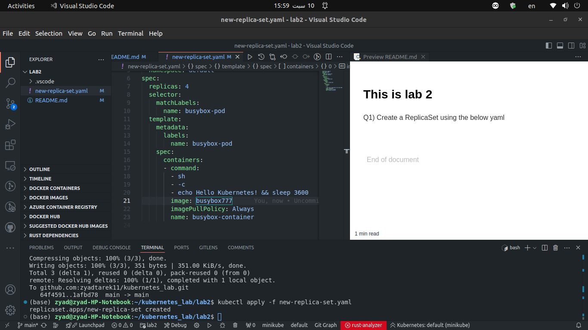
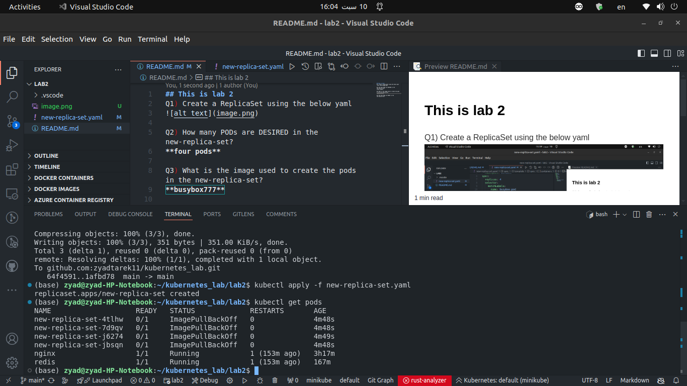
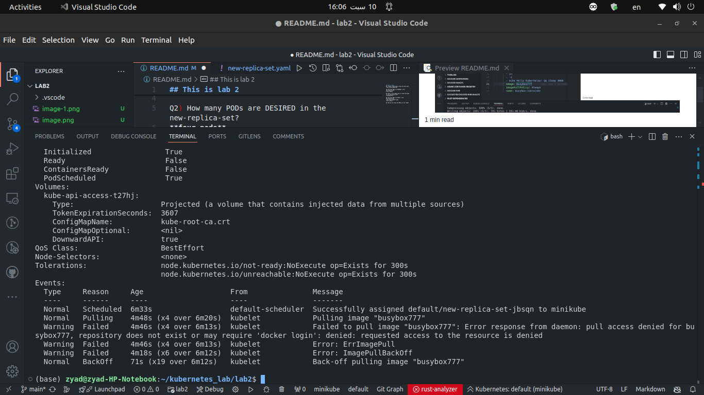
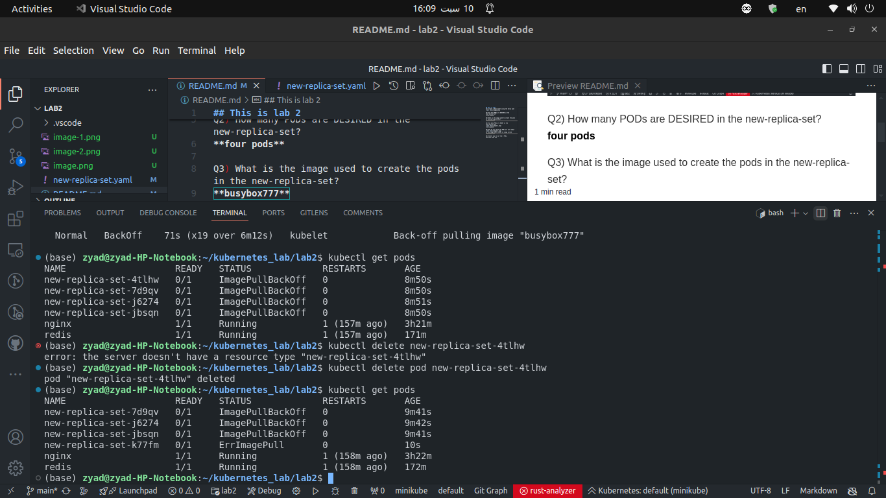

## This is lab 2
Q1) Create a ReplicaSet using the below yaml

Q2) How many PODs are DESIRED in the new-replica-set?
**four pods**

Q3) What is the image used to create the pods in the new-replica-set?
**busybox777**

Q4) How many PODs are READY in the new-replica-set?

**zero pods**

Q5) Why do you think the PODs are not ready?

As the image above shows no image called **busybox777**

Q6) Delete any one of the 4 PODs. 
How many pods now

Still **four** as it was 

Q7) Why are there still 4 PODs, even after you deleted one?
because the controller creates another one instead of the deleted one each time

Q8) Create a ReplicaSet using the below yaml
There is an issue with the file, so try to fix it.

apiVersion: apps/v1
kind: ReplicaSet
metadata:
  name: replicaset-1
spec:
  replicas: 2
  selector:
    matchLabels:
      tier: frontend
  template:
    metadata:
      labels:
        tier: frontend
    spec:
      containers:
      - name: nginx
        image: nginx

