## lab3
Q1) Create a deployment called my-first-deployment of image nginx:alpine in the default namespace.
Check to make sure the deployment is healthy.
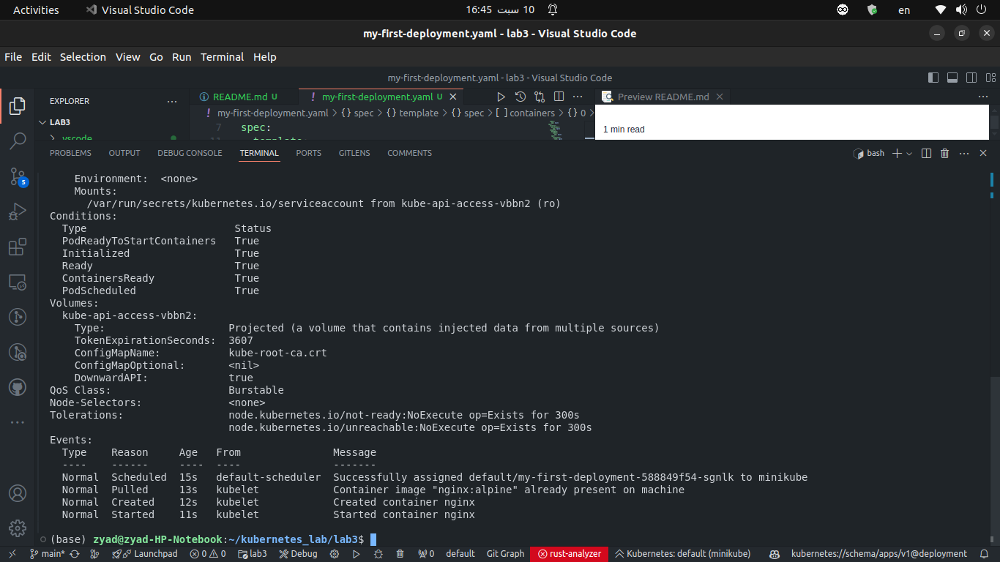
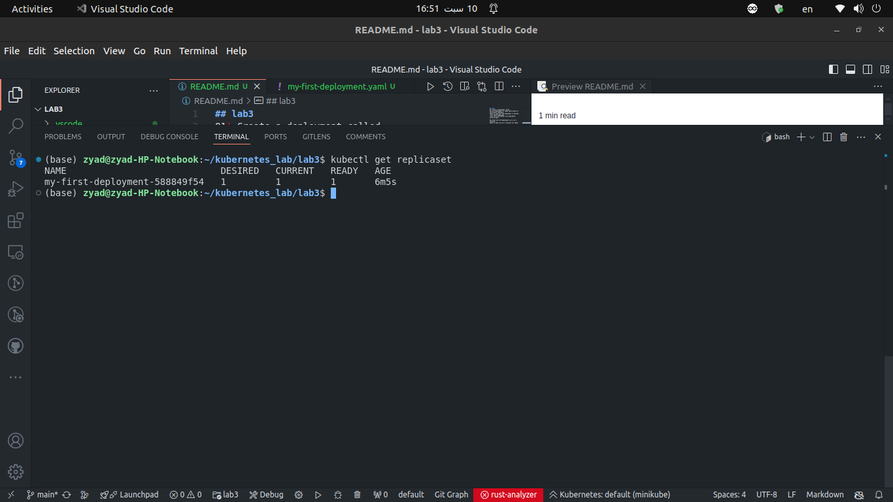

Q2) Scale my-first-deployment up to run 3 replicas.
Check to make sure all 3 replicas are ready.
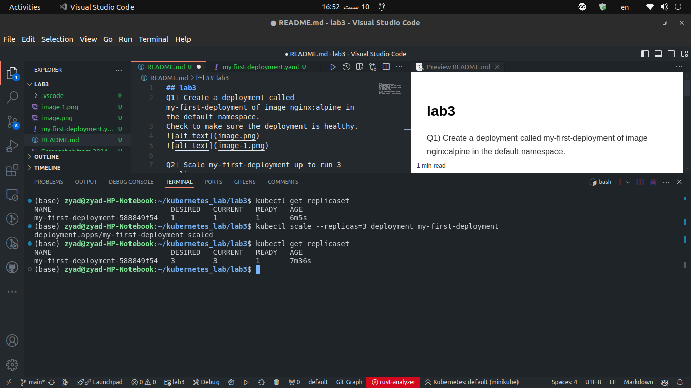

Q3) Scale my-first-deployment down to run 2 replicas
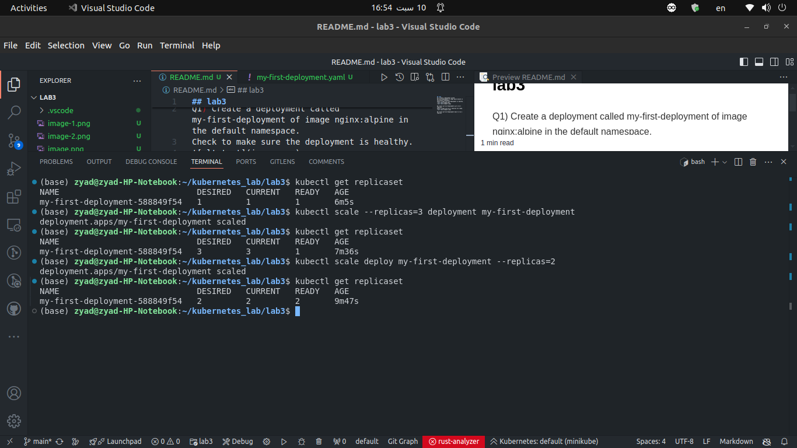

Q4) Change the image my-first-deployment runs from nginx:alpine to httpd:alpine
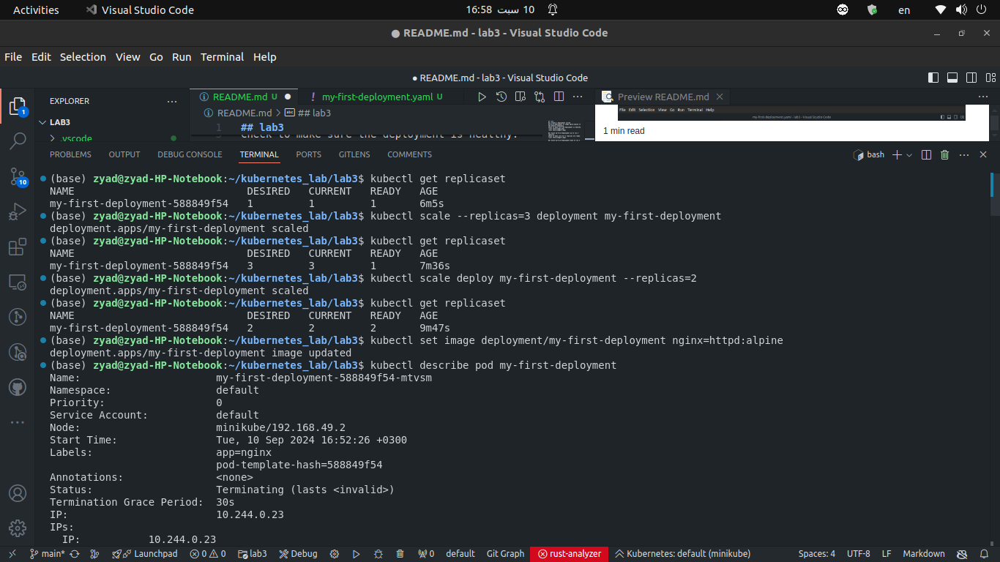
successfully replcaed the image with httpd:alpine
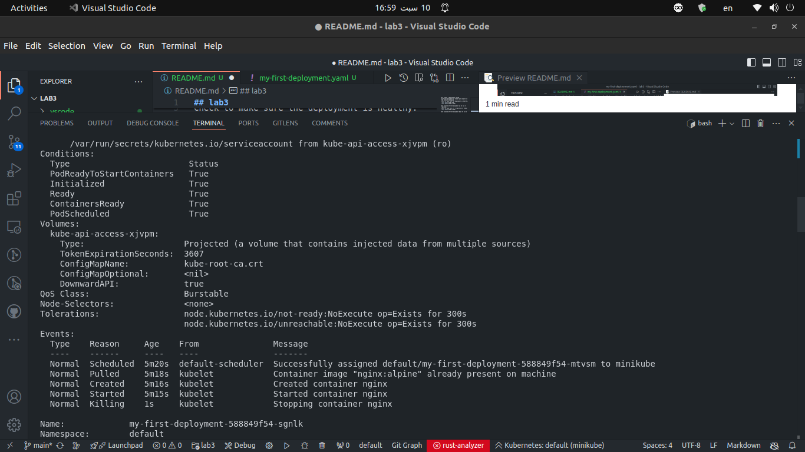

Q5) Delete the deployment my-first-deployment
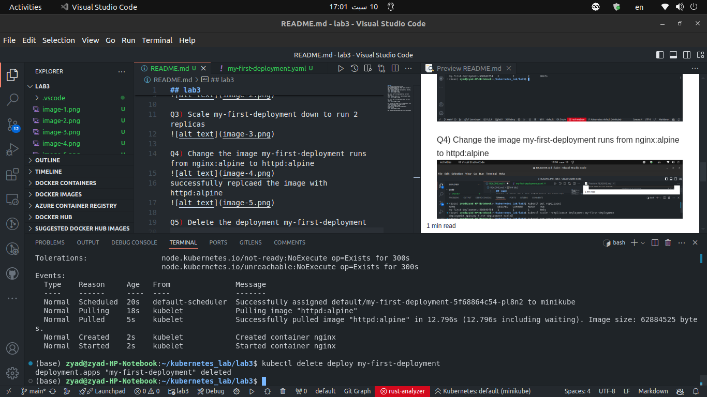

Q6) Create deployment from the below yaml

apiVersion: apps/v1
kind: Deployment
metadata:
  name: frontend-deployment
  namespace: default
spec:
  replicas: 4
  selector:
    matchLabels:
      name: busybox-pod
  strategy:
    rollingUpdate:
      maxSurge: 25%
      maxUnavailable: 25%
    type: RollingUpdate
  template:
    metadata:
      labels:
        name: busybox-pod
    spec:
      containers:
      - command:
        - sh
        - -c
        - echo Hello Kubernetes! && sleep 3600
        image: busybox888
        imagePullPolicy: Always
        name: busybox-container
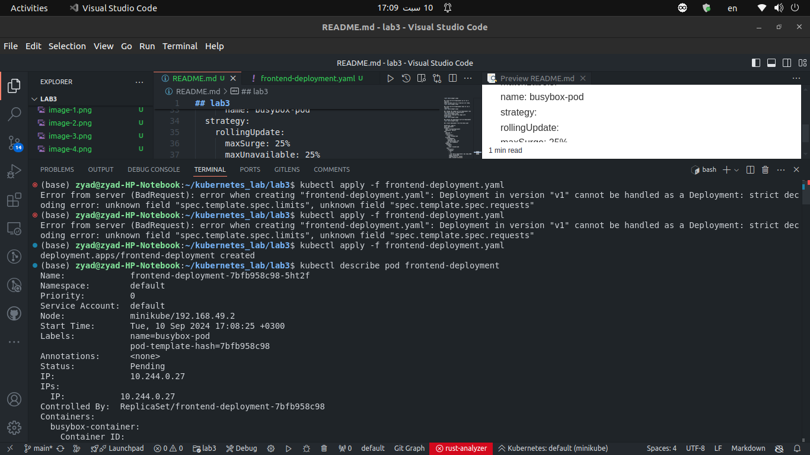

Q7) How many ReplicaSets exist on the system now?
**Four replicasets**
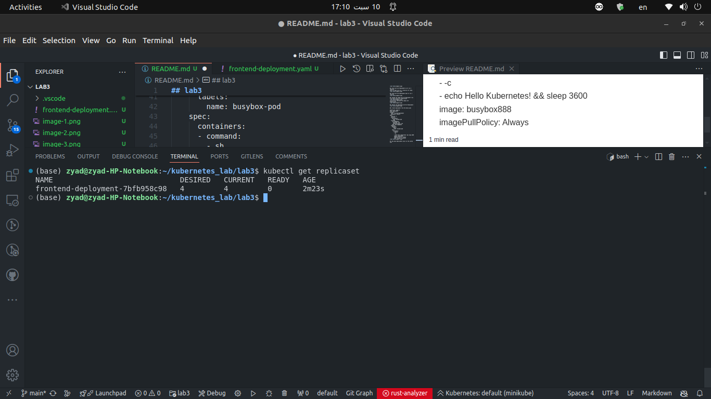

Q8) How many PODs exist on the system now?
**four pods**
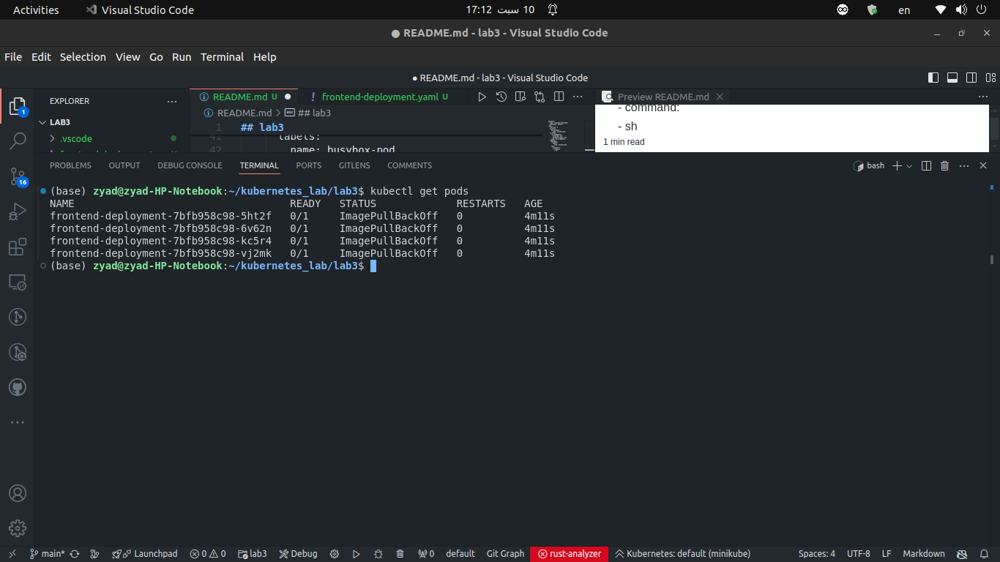

Q9) Out of all the existing PODs, how many are ready?
**Zero pods**

Q10) What is the image used to create the pods in the new deployment?
busybox888

Q11) Why do you think the deployment is not ready?
There is no image called **busybox888** on the server
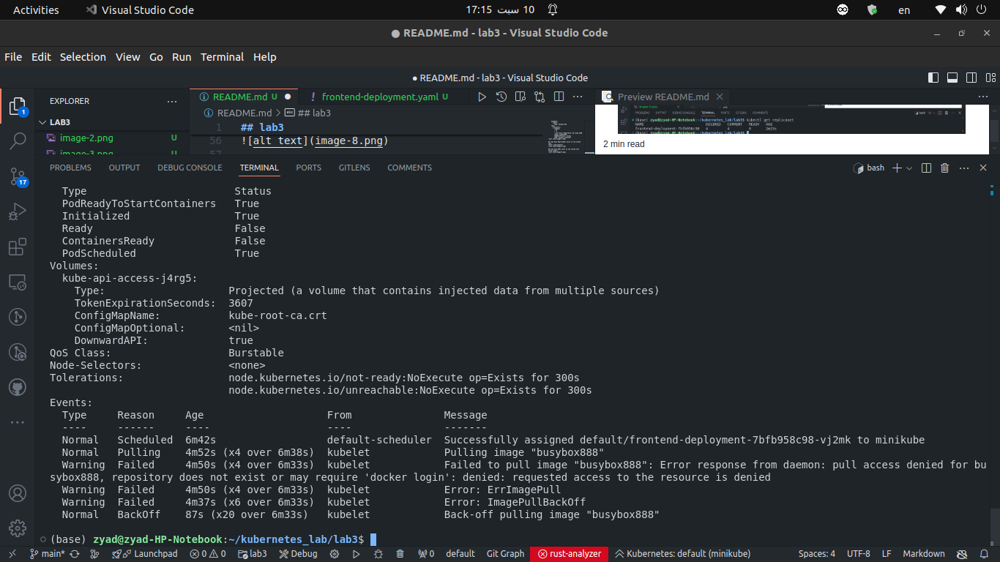

## Thanks for reading all the way down there 😍
