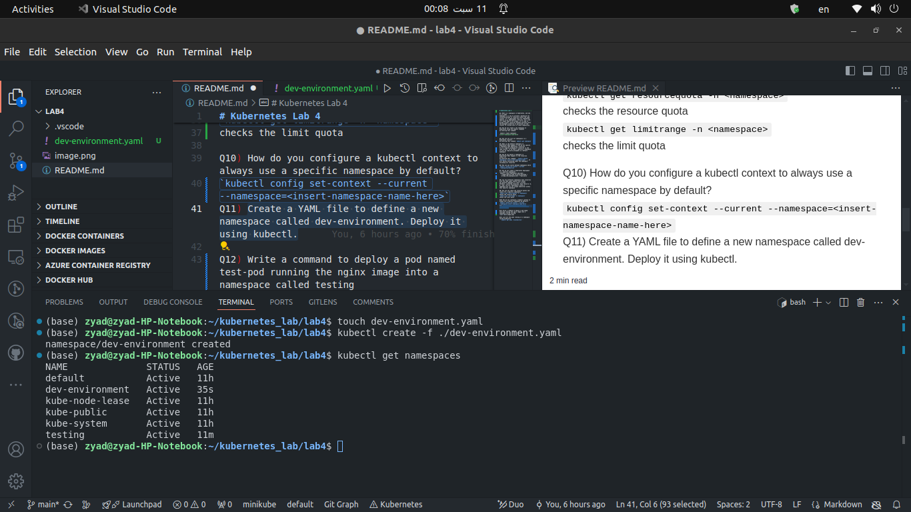
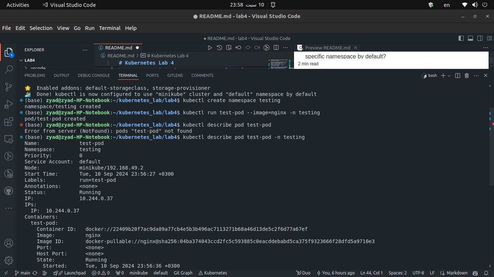

# Kubernetes Lab 4

Q1) What is a namespace in Kubernetes, and why is it used?
namespace is a way to provide a mechanism for isolating groups of resources within the same cluster, It is applicable only for namespaced objects (e.g. Deployments, Services, etc.) and it's names need to be unique, It is used to divide cluster resources between multiple users
and delegate authority to partitions of the cluster to trusted users in those communities.

Q2) How do you create a new namespace in Kubernetes using the kubectl command?
by entering this command

`kubectl create namespace <insert-namespace-name-here>
`

Q3) How can you list all namespaces in a Kubernetes cluster?
by entering this command `kubectl get namespace`

Q4) What is the default namespace in Kubernetes? What happens if you do not specify a namespace when deploying a resource?
It is a logical gropping of resources in the same cluster, If we didn't specifiy a namespace it will be logically groupped in a default namespace

Q5) How do you delete a namespace in Kubernetes? What happens to the resources within it?
by entering this command ```kubectl delete namespaces <insert-some-namespace-name>```, It will delete everything under the namespace including all resources

Q6) How can you switch between namespaces while `kubectl config set-context --current --namespace=production`

Q7) How do you create a Kubernetes deployment in a specific namespace?
`kubectl create deployment pod_name \
  --image=registry.k8s.io/serve_hostname \
  -n=type_the_namespace_here --replicas=2
  `
  
Q8) Can two different namespaces have resources with the same name? Explain your answer
yes because namespace is like a virtual boundary, isolating resources. Each resource (e.g., pod, service, deployment) within a namespace has its own unique identifier within that specific namespace

Q9) How can you check the resource quotas and limits for a specific namespace?
`kubectl get resourcequota -n <namespace>`
checks the resource quota
`kubectl get limitrange -n <namespace>`
checks the limit quota

Q10) How do you configure a kubectl context to always use a specific namespace by default?
`kubectl config set-context --current --namespace=<insert-namespace-name-here>`
Q11) Create a YAML file to define a new namespace called dev-environment. Deploy it using kubectl.


Q12) Write a command to deploy a pod named test-pod running the nginx image into a namespace called testing


Q13) List all the pods running in a namespace called production
```kubectl get pods -n=production```
