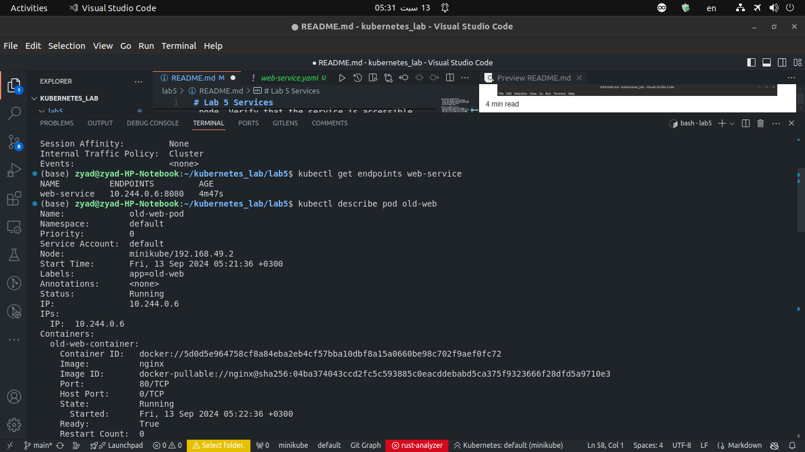

# Lab 5 Services

Q1) What is a Service in Kubernetes, and why is it needed?
A method for exposing a network application that is running as one or more Pods in your cluster, because it helps us expose groups of Pods over a network as a set of logical end points.

Q2) What are the different types of Services in Kubernetes (e.g., ClusterIP, NodePort) and what are their use cases?
**clusterIP**
Exposes the Service on a cluster-internal IP amking it only reachable from within the cluster and that is the default type.
**NodePort**
Exposes the Service on each Node's IP at a static port (the NodePort) To make the node port available
**LoadBalancer**
Exposes the Service externally using an external load balancer (you must provide one first)
**External Name**
Maps the Service to a DNS name, The mapping configures your cluster's DNS server to return a CNAME record with that external hostname value

Q3) what are LoadBalancer, ExternalName service in kuberenetes and what are their use cases?
**LoadBalancer Service**
service in Kubernetes automatically provisions an external load balancer and assigns a public IP address to the service
**UseCases**
When you need external access to your application or Auto-provision of a cloud load balancer
**ExternalName Service**
an object that Maps the Service to a DNS name, The mapping configures your cluster's DNS server to return a CNAME record with that external hostname value
**useCases**
Accessing External Services and External API Gateway and Avoiding Hardcoding External Endpoints

Q4)  How does a Kubernetes Service use selectors to identify the Pods it routes traffic to? Can a Service be created without a selector?
A Kubernetes Service uses selectors to match labels on Pods, routing traffic to those Pods. Yes, a Service can be created without a selector, typically for externalName or manually defined Endpoints.

Q5) Explain how a NodePort service works in Kubernetes. What are its advantages and limitations?
A NodePort service in Kubernetes exposes a service on each Node's IP at a static port (the NodePort). When a request is made to any Node's IP on the NodePort, it is forwarded to the service, which then routes it to the appropriate Pod.

**Advantages**:

- easy access from outside the cluster
  
**Limitations**:

- limited port range
- potential security risks

Q6) What is a Headless Service in Kubernetes, and when would you use it? How does it differ from a standard ClusterIP service?
A Headless Service in Kubernetes is a service without a cluster IP.
It is used when you want direct access to the Pods without load balancing.
It differs from a standard ClusterIP service by not providing a stable IP address; instead, it returns the IPs of the associated Pods directly.This is useful for stateful applications where each Pod needs to be addressed individually.

Q7) Create a ClusterIP Service:
 Write a YAML definition for a ClusterIP service that exposes a deployment named my-app running on port 8080. Ensure the service maps to port 80 inside the cluster.

Q8) Set up a NodePort Service:
 Create a NodePort service that exposes a deployment named backend on port 30001 of each node. Verify that the service is accessible externally via the node’s IP and port 30001.

Q9) Test Service with Selectors:
 Create a ClusterIP service named web-service with the selector app: old-web. Deploy two sets of Pods, one with the label app: old-web and another with the label app: api. Verify that only the web Pods receive traffic.

web-service is running and has an end point at 10.244.0.6:8080

old-web-pod is running and has an IP :10.244.0.6 which means that only the traffic routes from web-service routes to it

api-pod has an IP: 10.244.0.7 and since web-service doesnot has an end point at this ip that confirms that the traffic doesnot routes to it because it has a different label from the selector label: old-web

Q10) Change Service Selector:
 Update an existing service to change its selector from app: old-web to app: new-web. Verify that the traffic is now routed only to Pods with the new label.

After reconfiguring the web-service and change the label to new-web it shows there is no endpoint and that is the expected behaviour

After creating another pod with new-web label it shows that the web-service has an end point with the same IP of the new pod which confirms that everything works as intended :)

Q11) Configure a Service for Multiple Ports:
 Define a service that exposes multiple ports (e.g., 80 for HTTP and 443 for HTTPS) on a deployment named multi-port-app "get the front in app from your own choice". Verify both ports are accessible within the cluster.
